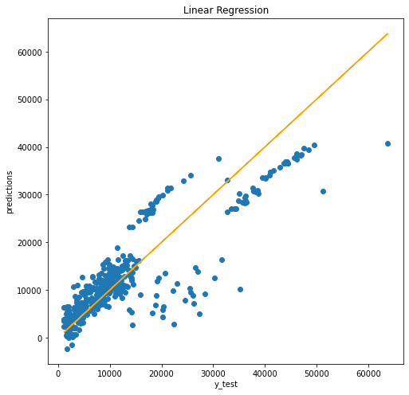
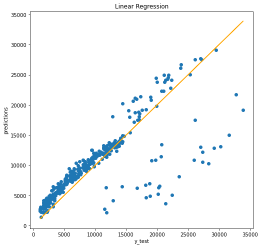
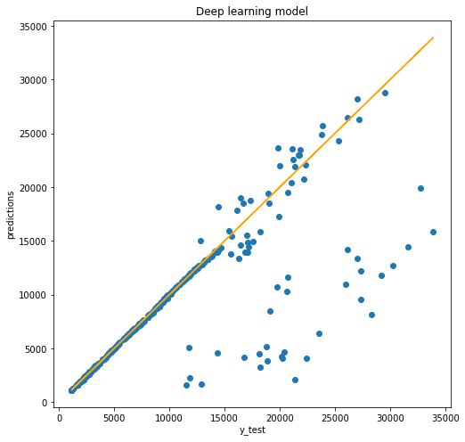

# Medical insurance cost model - Regression with deep learning
- This project attempts to find a model that can accurately predict the price of medical insurance.
- The data used in this project comes from a [raw](https://raw.githubusercontent.com/stedy/Machine-Learning-with-R-datasets/master/insurance.csv) data source.
- This project includes data exploration using libraries such as Seaborn, Matplotlib, Pandas and NumPy.  Using these libraries, I explored the possible correlations between insurance prices and the six different characteristics of a particular person.
- I initially used sklearn to develop a linear regression model to predict insurance prices. This linear regression model had an absolute error of around **$4000** and the square root of the mean squared error was around **$6000**.
- Below is an image of the correct values against the predictions.

- To improve this model, I decided to drop some of the insurance prices in the excessive price range (outliers) as the model found these hard to predict. I hoped by dropping the outliers that the predictions for most of the insurance prices would improve.
- Doing this improved the results as the absolute error dropped to around **$2500** and the square root of the mean squared error dropped to around **$4250**.
- Below is an image of the correct values against the predictions for the new model.

- The linear regression model had a lower error if the price was not in the outlier range.
- To improve on this model,  I made a deep learning model using neural networks. Using TensorFlow and Keras I was able to make a regression model.
- I tested this model on the same dataset again without the outliers.
- This deep learning model has an absolute error of around **$1500** and the square root of the mean squared error is around **$4300**.

- The model is particularly good at predicting prices up to around $15000, but like the linear regression model, this model struggles to predict beyond that price.
- If I were to spend more time on this project, I would look more closely at what factors affect the price of someone's medical insurance costs. I would also seek more data to explain the outliers and some of the higher insurance prices people have been charged.
